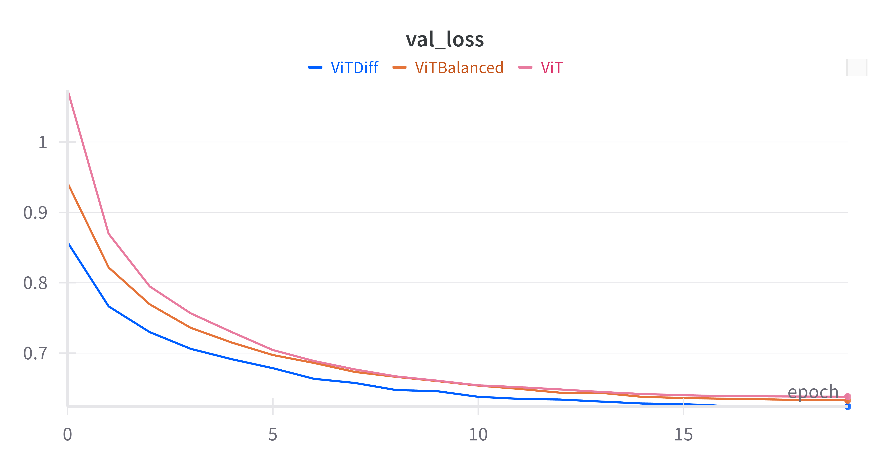

# NanoDiffVision 🐜

NanoDiffVision is a research project in Deep Learning aimed at re-implementing the Vision Transformer (ViT) from scratch while exploring and comparing two attention mechanisms: the classic Self-Attention and Differential Attention (introduced in the DIFF Transformer paper). The project focuses on compact models, making the approach accessible and efficient even with limited resources.

## 📚 Background

Transformers have revolutionized the field of computer vision. NanoDiffVision focuses on re-implementing the Vision Transformer (ViT) while evaluating Differential Attention, a recent mechanism designed to reduce attention noise and focus more on relevant information. The project builds on the insights from the Vision Transformer paper ["An Image is Worth 16x16 Words"](https://arxiv.org/abs/2010.11929) and the [DIFF Transformer paper](https://arxiv.org/abs/2410.05258), which introduces the Differential Attention mechanism.

## 🎯 Objectives

- **Reproduce the Vision Transformer (ViT)** from scratch to better understand its components.
- **Integrate and compare** classic Self-Attention with Differential Attention.
- **Analyze the performance** of compact models, especially in terms of their ability to handle relevant information while limiting noise.

## 🛠️ Installation

To install and use NanoDiffVision, follow the steps below:

```bash
git clone https://github.com/eithannak29/NanoDiffVision.git
cd NanoDiffVision
uv sync
```

## 🧪 Usage

To train the model, use the provided Makefile:

To train on all CIFAR10 configurations:

```bash
make cifar10
```

To train on all MNIST configurations:

```bash
make mnist
```

To train on all FashionMNIST configurations:

```bash
make fashionmnist
```

To run a specific configuration file:

```bash
make config CONFIG_FILE=configs/CIFAR10/lite_config.yml
```

## 📊 Results

### Results on the MNIST Dataset

The chart below compares the validation loss of three configurations of NanoDiffVision on the MNIST dataset:

Three model configurations were evaluated on the MNIST dataset to compare the performance of the standard Vision Transformer and Differential Attention:

<div align="center">
  
</div>

The chart below compares the validation loss of three configurations of NanoDiffVision on the MNIST dataset:

<div align="center">

| **Model**                | **Parameters** | **Validation Loss** | **Test Loss** | **Test Accuracy** |
|--------------------------|----------------|---------------------|---------------|--------------------|
| **ViT**         | 33.8K          | 0.638               | 0.626         | 95.51%            |
| **ViTBalanced** | 55.6K          | 0.633               | 0.624         | 95.53%            |
| **ViT_Diff**    | 38.1K          | 0.624               | 0.618         | 95.75%            |

</div>
### Analysis

- **MNSITliteViT_Diff** achieves the best validation loss with a low parameter count, confirming the effectiveness of Differential Attention in reducing noise and extracting relevant information.
- **MNSITliteViT_balanced**, despite having more parameters, does not show significant improvements, indicating potential overfitting.
- **MNSITliteViT** remains competitive but is outperformed by the Differential Attention variant.

### Conclusion

Differential Attention proves to be a promising approach for compact models, offering better relevance management without significantly increasing the parameter count.


## 🏛️ License

This project is licensed under the MIT License. See the [LICENSE](LICENSE) file for more details.
