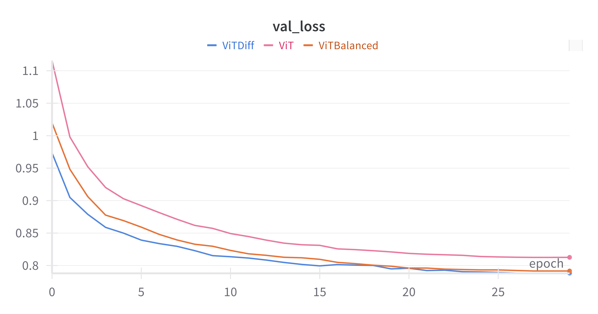

# NanoDiffVision 🐜 : Exploring the Future of Vision Transformers with Differential Attention


</div>

NanoDiffVision is a research project in Deep Learning aimed at re-implementing the Vision Transformer (ViT) from scratch while exploring and comparing two attention mechanisms: the classic Self-Attention and Differential Attention (introduced in the DIFF Transformer paper). By integrating these advancements, the project envisions Differential Attention as a potential natural evolution of Transformers, offering a more efficient and focused mechanism for attention. The project focuses on compact models, making the approach accessible and efficient even with limited resources.

## 📚 Background

Transformers have revolutionized the field of computer vision. NanoDiffVision focuses on re-implementing the Vision Transformer (ViT) while evaluating Differential Attention, a recent mechanism designed to reduce attention noise and focus more on relevant information. The project builds on the insights from the Vision Transformer paper ["An Image is Worth 16x16 Words"](https://arxiv.org/abs/2010.11929) and the [Differential Transformer paper](https://arxiv.org/abs/2410.05258), which introduces the Differential Attention mechanism.

## 🎯 Objectives

- **Reproduce the Vision Transformer (ViT)** from scratch to better understand its components.
- **Integrate and compare** classic Self-Attention with Differential Attention.
- **Analyze the performance** of compact models, especially in terms of their ability to handle relevant information while limiting noise.

## 📦 Installation

To install and use NanoDiffVision, follow the steps below:

```bash
git clone https://github.com/eithannak29/NanoDiffVision.git
cd NanoDiffVision
uv sync

```
If you don't have **uv** installed, please refer to the [installation guide here](https://docs.astral.sh/uv/getting-started/installation/).

## 🧪 Usage

To train the model, use the provided Makefile:

To train on all MNIST configurations:

```bash
make mnist
```

To train on all FashionMNIST configurations:

```bash
make fashionmnist
```

To run a specific configuration file:

```bash
make config CONFIG_FILE=configs/MNIST/lite_config.yml
```

## 📊 Results

### Results on the MNIST Dataset

The chart below compares the validation loss of three configurations on the MNIST dataset:

Three model configurations were evaluated on the MNIST dataset to compare the performance of the standard Vision Transformer and Differential Attention:

<div align="center">

| **Model**                | **Parameters** | **Num Heads** | **Validation Loss** | **Test Loss** | **Test Accuracy** |
|--------------------------|----------------|---------------|---------------------|---------------|--------------------|
| **ViT**         | 81.5K          | 2             | 0.748               | 0.724         | 91.70%            |
| **ViTBalanced** | 81.5K          | 4             | 0.672               | 0.653         | 94.76%            |
| **ViTDiff**    | 98.2K          | 2             | 0.627               | 0.619         | 96.03%            |

</div>

<div align="center">
  
</div>


### Results on the FashionMNIST Dataset

#### Validation Loss on FashionMNIST Dataset

The chart below compares the validation loss of three configurations on the FashionMNIST dataset:

Three model configurations were evaluated on the FashionMNIST dataset to compare the performance of the standard Vision Transformer and Differential Attention:

<div align="center">
  
| **Model**                | **Parameters** | **Num Heads** | **Validation Loss** | **Test Loss** | **Test Accuracy** |
|--------------------------|----------------|---------------|---------------------|---------------|--------------------|
| **ViT**         | 81.5K          | 2             | 0.866               | 0.883         | 83.14%            |
| **ViTBalanced** | 81.5K          | 4             | 0.839               | 0.844         | 84.90%            |
| **ViTDiff**    | 98.2K          | 2             | 0.789               | 0.799         | 86.73%            |

</div>

</div>

<div align="center">
  
</div>

### Conclusion

The results emphasize the potential of Differential Attention as a lightweight yet highly effective alternative to traditional Self-Attention mechanisms. With significantly fewer parameters compared to ViTBalanced, ViTDiff achieves comparable if not better performance across all evaluated metrics. This highlights its promise as a transformative approach in vision tasks, especially in resource-constrained environments.

## 🔗 References

1. ["An Image is Worth 16x16 Words"](https://arxiv.org/abs/2010.11929)
2. [Differential Transformer paper](https://arxiv.org/abs/2410.05258)

## 💫 Show your support

Give a 💫 if this project helped you understand Differential Attention!

